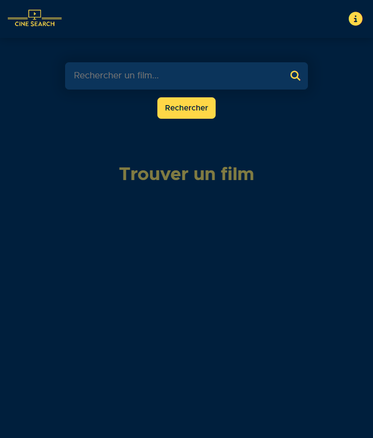
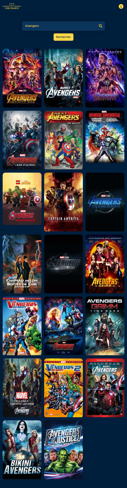

# cine-search-app

Cine Search est un Site web de recherche de film.

## Installation du projets

```sh
npm install

npm run dev
```

### Compilation et Minification Du Projets pour le deployement

```sh
npm run build
```

## Capture

Capture D'écran du projets

### Mobile


### Mobile Recherche


### Mobile Details


### Tablette



### Tablette Recherche



### Tablette Details


### Bureau


### Bureau Recherche


### Bureau Details


## Technos Utilisées

- Vue Js
- Vue Router
- Compositon API
- Sass
- NPM
- Vite
- Axios

## Liens

- Liens de la page: [Add live site URL here](https://your-live-site-url.com)

## Auteur

- GitHub - [Souleymane Sy](https://github.com/SouleymaneSy7)
- Frontend Mentor - [@SouleymaneSy7](https://www.frontendmentor.io/profile/SouleymaneSy7)
- Twitter - [@Souleymanesy43](https://twitter.com/Souleymanesy43)
